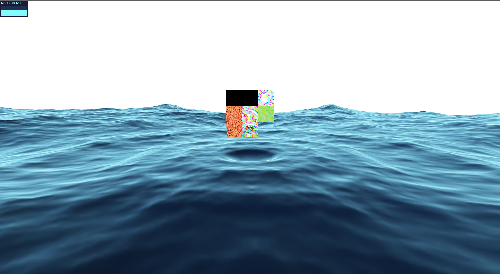
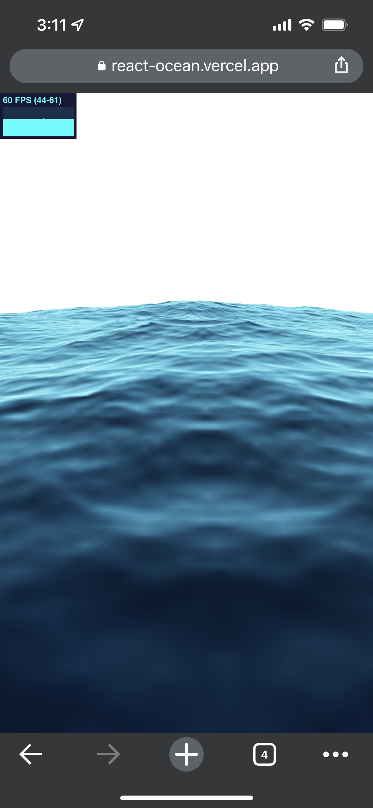

# FFT Ocean with React Three Fiber

[Live demo](https://react-ocean.vercel.app)





This is a FFT Ocean with React Three Fiber, Inspiring by 
[David Li's WebGL ocean wave simulation](https://github.com/dli/waves)

## Getting Started

First, run the development server:

```bash
yarn install

yarn dev
```

Open [http://localhost:3000](http://localhost:3000) with your browser to see the result.
